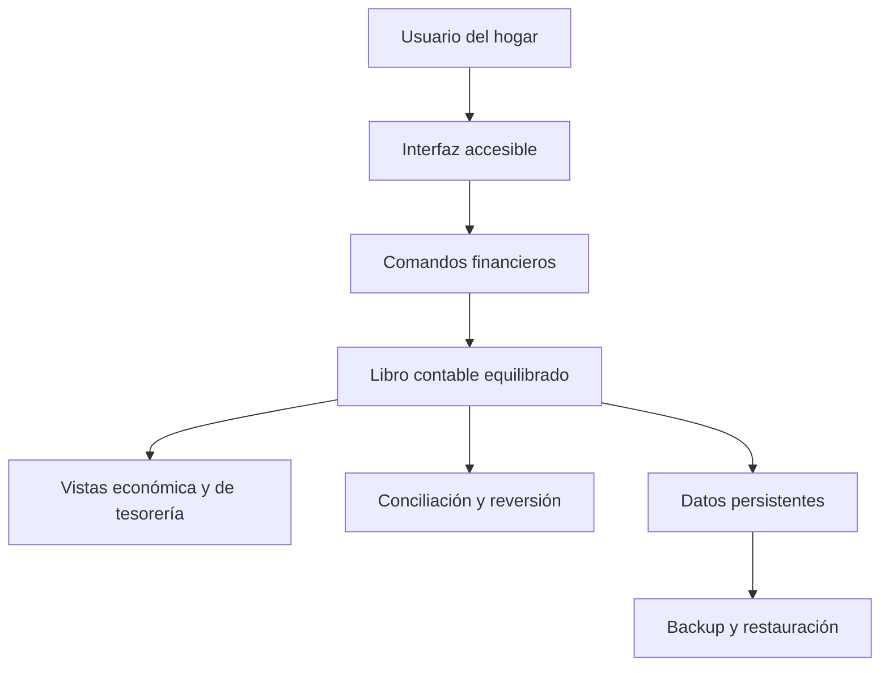
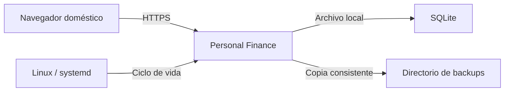
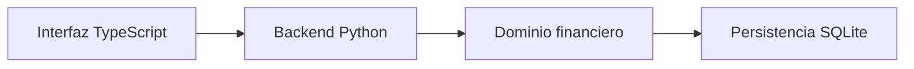
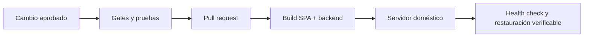
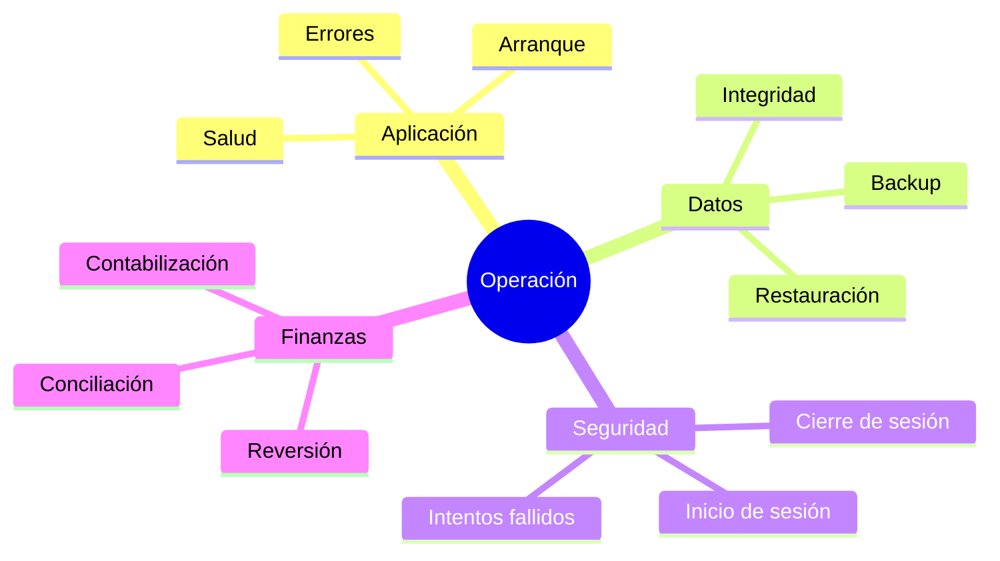
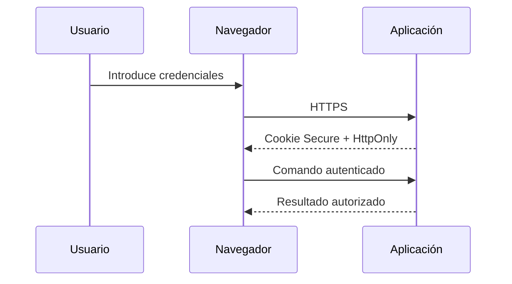
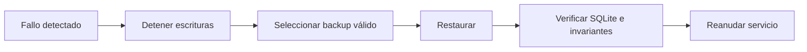
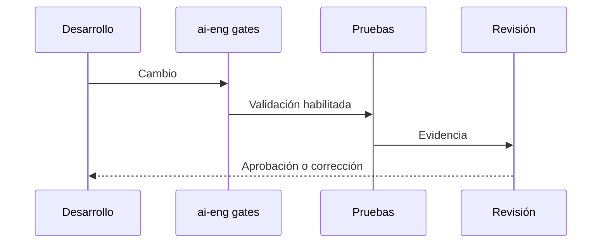

# Solution Intent — Personal Finance

> Status: Evolving
> Last Review: 2026-07-23

## 1. Introducción

### 1.1 Identidad

| Campo | Valor |
|---|---|
| Producto | Personal Finance |
| Estado | Greenfield |
| Versión del producto | TBD — pendiente de primera entrega |
| Uso | Privado, doméstico y limitado a la red local |
| Modelo operativo inicial | Una persona y un espacio financiero |
| Licencia | TBD — pendiente de definición |

### 1.2 Objetivo y problema

Personal Finance permitirá registrar, consultar y comprender las finanzas del
hogar con rigor contable interno y lenguaje accesible. El producto debe reunir
saldo, actividad económica y movimientos reales de dinero sin obligar al
usuario a conocer terminología contable.

### 1.3 Resultados deseados

| Resultado | Evidencia esperada |
|---|---|
| Libro íntegro | Toda operación contabilizada está equilibrada |
| Datos comprensibles | La interfaz usa acciones y términos cotidianos |
| Historial trazable | Las correcciones conservan la operación original |
| Operación doméstica segura | Acceso de red cifrado y autenticado |
| Datos recuperables | Existe una copia válida y una restauración probada |

### 1.4 Alcance

La primera entrega cubre el núcleo financiero vertical definido en `spec-001`.
Tarjetas, préstamos, devengos, reservas, presupuestos, previsiones y espacios
compartidos avanzarán mediante especificaciones posteriores.

### 1.5 Partes interesadas

| Persona | Necesidad | Coste de un fallo |
|---|---|---|
| Persona operadora | Registrar y comprender sus finanzas | Datos incorrectos o perdidos |
| Miembro del hogar | Consultar y usar el espacio autorizado | Acceso indebido o información confusa |
| Responsable del servidor | Instalar, actualizar y recuperar | Indisponibilidad o restauración fallida |

## 2. Requisitos de la solución

### 2.1 Arquitectura funcional

### 2.2 Requisitos por dominio

| Dominio | Primera entrega | Evolución prevista |
|---|---|---|
| Identidad | Usuario local y espacio financiero personal | Varios usuarios y espacios compartidos |
| Clasificación | Categorías planas y personalizables | Subcategorías |
| Libro | Saldo inicial, ingreso, gasto y transferencia | Operaciones financieras avanzadas |
| Control | Borrador, contabilización, reversión y conciliación | Planificación y operaciones pendientes |
| Informes | Saldos, patrimonio, devengo y tesorería básicos | Presupuesto, previsión y calidad de datos |
| Operación | HTTPS en LAN, backup local y restauración | Copias externas y recuperación ampliada |

### 2.3 Requisitos no funcionales

| Categoría | Requisito | Umbral o evidencia |
|---|---|---|
| Integridad | Débitos y créditos coinciden exactamente | Obligatorio antes de contabilizar |
| Precisión | Importes enteros en céntimos EUR | Ningún importe monetario usa `float` |
| Atomicidad | Operación y apuntes se confirman juntos | Todo o nada |
| Seguridad | Sesión cifrada desde otros dispositivos | HTTPS obligatorio en LAN |
| Recuperación | Copia diaria verificable | Restauración real antes de aceptar la entrega |
| Calidad | Cobertura automatizada | Mínimo configurado por `ai-eng`: 80 % |

### 2.4 Integraciones

| Integración | Contrato inicial | Estado |
|---|---|---|
| Navegador | SPA y API bajo un mismo origen | Planificada |
| SQLite | Un archivo de datos no expuesto a la red | Planificada |
| Linux | Arranque y reinicio del servicio | Planificada |
| Backup local | Retención configurable y restauración manual | Planificada |

## 3. Diseño técnico

### 3.1 Stack y límites

| Capa | Restricción vigente |
|---|---|
| Interfaz | TypeScript; framework a decidir en `/ai-plan` |
| Backend | Python; framework a decidir en `/ai-plan` |
| Persistencia | SQLite; acceso y migraciones a decidir en `/ai-plan` |
| Gráficos | TBD — fuera del núcleo inicial si no son necesarios |
| Despliegue | Un servicio doméstico; mecanismo a decidir en `/ai-plan` |

El producto mantiene un monolito modular y un único servicio. Docker,
microservicios y PostgreSQL permanecen fuera del alcance hasta que exista una
necesidad demostrada.

### 3.2 Entornos

| Entorno | Propósito | Red | Datos |
|---|---|---|---|
| Desarrollo | Construcción y pruebas | Localhost | Datos sintéticos |
| Pruebas | Validación automatizada | Aislada | Fixtures |
| Doméstico | Uso real | LAN mediante HTTPS | Directorio persistente protegido |

### 3.3 Políticas de API

| Superficie | Política |
|---|---|
| Operaciones financieras | Comandos de negocio; no apuntes arbitrarios |
| Consultas | Vistas derivadas del libro |
| Autenticación | Sesión local con cookie segura y no accesible a JavaScript |
| Versionado | TBD — se definirá antes de exponer contratos estables |
| Límites de uso | TBD — no hay exposición pública |

### 3.4 Publicación y despliegue

| Artefacto | Destino | Regla |
|---|---|---|
| Código | Directorio de aplicación | Sin escritura de datos financieros |
| Datos | Directorio persistente | Escritura limitada al usuario del servicio |
| Backup | Directorio separado | Copia consistente y retención configurable |

## 4. Observabilidad

### 4.1 Señales

### 4.2 SLI, alertas y registros

| Señal | Evidencia | Condición de atención |
|---|---|---|
| Servicio | Estado y logs de systemd | Reinicios repetidos o servicio caído |
| Integridad | Validación contable | Cualquier desequilibrio |
| Backup | Resultado de copia y verificación | Una ejecución fallida |
| Restauración | Resultado de prueba | Archivo no recuperable |
| Seguridad | Eventos de sesión | Patrón anómalo o acceso rechazado repetido |

Los logs no incluirán contraseñas, tokens de sesión ni contenido financiero
innecesario. La retención detallada queda TBD hasta definir el entorno doméstico.

### 4.3 Runbooks

| Runbook | Estado |
|---|---|
| Arranque y diagnóstico del servicio | Pendiente |
| Backup y restauración | Obligatorio para `spec-001` |
| Actualización y migración | Pendiente |
| Recuperación ante corrupción | Pendiente |

## 5. Seguridad

### 5.1 Acceso

### 5.2 Exposición y controles

| Superficie | Visibilidad | Control mínimo |
|---|---|---|
| Aplicación | LAN doméstica | HTTPS y autenticación |
| HTTP | Solo localhost | Sin exposición a otros dispositivos |
| Base de datos | Host local | Sin puerto de red |
| Backups | Sistema de archivos | Permisos restringidos |
| Logs | Host local | Sin secretos ni datos financieros innecesarios |

### 5.3 Recuperación

### 5.4 Hardening

| Control | Gate o evidencia | Estado |
|---|---|---|
| Secretos | Gitleaks | Activo |
| Código inseguro | Semgrep | Activo |
| Dependencias Python | pip-audit | Activo |
| Cookies seguras | Prueba de aceptación | Pendiente |
| CSRF | Prueba de aceptación según mecanismo de sesión | Pendiente |
| Usuario sin privilegios | Verificación de despliegue | Pendiente |

## 6. Calidad

### 6.1 Flujo de calidad

| Gate | Criterio |
|---|---|
| Contabilidad | Invariantes cubiertas por pruebas |
| Seguridad | Sin findings bloqueantes |
| Migraciones | Aplicación y recuperación verificadas |
| Documentación | README, CHANGELOG y Solution Intent coherentes |
| Aceptación | Escenarios de `spec-001` demostrables |

### 6.2 Estrategia de pruebas

| Nivel | Objetivo | Estado |
|---|---|---|
| Dominio | Invariantes y transiciones | Pendiente |
| Persistencia | Atomicidad, migraciones y SQLite | Pendiente |
| API | Comandos y autorización | Pendiente |
| Interfaz | Flujos accesibles | Pendiente |
| Extremo a extremo | Escenarios principales y restauración | Pendiente |

### 6.3 Escalabilidad

| Dimensión | Objetivo inicial | Evolución |
|---|---|---|
| Usuarios | Hogar y baja concurrencia | Espacios compartidos |
| Escrituras | Un proceso backend | Reevaluar solo con evidencia |
| Moneda | EUR | Multimoneda fuera de V1 |
| Clasificación | Categorías planas | Subcategorías |
| Persistencia | SQLite | PostgreSQL solo por necesidad demostrada |

## 7. Próximos objetivos

### 7.1 Hoja de ruta

| Fase | Alcance | Estado |
|---|---|---|
| Núcleo financiero | Usuario, espacio, cuentas, categorías, operaciones básicas, conciliación, backup | `spec-001` en borrador |
| Pasivos | Tarjetas de crédito, préstamos y deudas por cobrar/pagar | Planificada |
| Periodicidad | Recurrentes, obligaciones, devengos y reservas | Planificada |
| Presupuesto | Asignaciones mensuales, financiación entre periodos y dinero disponible | Planificada |
| Análisis avanzado | Dashboard presupuestario, previsiones y calidad de datos | Planificada |
| Evolución doméstica | Subcategorías, varios usuarios y espacios compartidos/familiares | Planificada |

### 7.2 Capacidades activas

| Capacidad | Prioridad | Estado |
|---|---|---|
| Núcleo contable accesible | Alta | Refinamiento |
| Recuperación doméstica | Alta | Refinamiento |
| Pasivos y periodicidad | Media | Backlog |
| Presupuesto y previsión | Media | Backlog |
| Colaboración familiar | Baja | Backlog |

### 7.3 Indicadores

| Indicador | Objetivo | Actual |
|---|---|---|
| Transacciones desequilibradas aceptadas | 0 | Sin implementación |
| Escenarios de aceptación superados | 100 % de `spec-001` | Sin implementación |
| Restauraciones verificadas antes de entrega | 1 como mínimo | 0 |
| Findings bloqueantes al entregar | 0 | 0 |

### 7.4 Especificación activa

| Spec | Título | Estado | Ruta |
|---|---|---|---|
| `spec-001` | Primera versión de Personal Finance | Draft | `.ai-engineering/specs/spec.md` |

### 7.5 Riesgos y bloqueos

| ID | Riesgo | Severidad | Mitigación |
|---|---|---|---|
| R-01 | Alcance vuelve a crecer hasta abarcar toda la visión | Alta | Una spec por bloque de roadmap |
| R-02 | Complejidad contable visible para el usuario | Alta | Vocabulario y comandos accesibles |
| R-03 | Copia válida pero restauración fallida | Alta | Prueba real de restauración |
| R-04 | Sesión expuesta dentro de la LAN | Alta | HTTPS obligatorio |
| R-05 | Duplicidad de fuentes de saldo | Alta | Libro como única fuente canónica |
