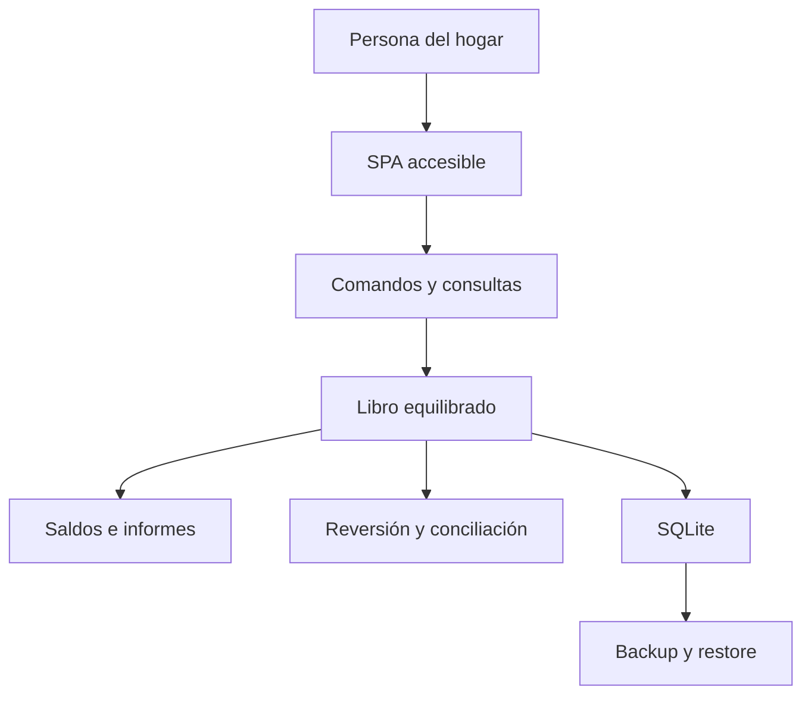
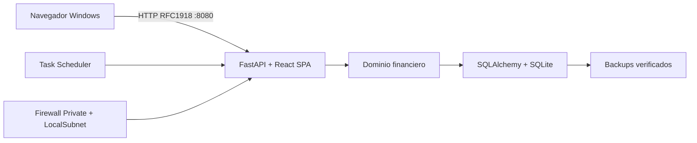

# Solution Intent — Personal Finance

> Status: Evolving
> Last Review: 2026-08-10

## 1. Identidad y objetivo

| Campo | Valor |
|---|---|
| Producto | Personal Finance |
| Estado | `spec-001` en implementación, aceptación HITL confirmada |
| Versión | 0.1.0, pendiente de integración |
| Uso | Privado, doméstico y limitado a una LAN de confianza |
| Host y clientes | Windows 10/11 x64 |
| Modelo inicial | Una persona y un espacio financiero |

Personal Finance registra y explica las finanzas del hogar con un libro
contable interno equilibrado y lenguaje cotidiano. La persona usuaria trabaja
con saldo inicial, ingresos, gastos y transferencias sin editar débitos o
créditos directamente.

La primera entrega incluye borradores, contabilización, reversión,
conciliación, informes básicos, autenticación local, auditoría, backup diario y
restauración aislada. Tarjetas, préstamos, presupuestos, previsiones,
subcategorías, multimoneda y colaboración avanzada quedan fuera de `spec-001`.

## 2. Resultados y requisitos

| Resultado | Evidencia |
|---|---|
| Libro íntegro | Toda operación contabilizada queda equilibrada y es inmutable |
| Precisión monetaria | EUR en céntimos enteros; nunca `float` |
| Historial trazable | La reversión conserva la operación original |
| Experiencia comprensible | Acciones financieras y mensajes cotidianos y accesibles |
| Acceso doméstico | Sesión local desde clientes Windows de la LAN |
| Datos recuperables | Backup diario verificado y restore aislado con integridad `ok` |

| Dominio | Primera entrega | Evolución prevista |
|---|---|---|
| Identidad | Usuario local y espacio personal | Varios usuarios y espacios |
| Clasificación | Categorías planas personalizables | Subcategorías |
| Libro | Saldo inicial, ingreso, gasto y transferencia | Pasivos y periodicidad |
| Control | Borrador, contabilización, reversión y conciliación | Planificación |
| Informes | Saldos, patrimonio, devengo y tesorería | Presupuesto y previsión |
| Recuperación | Backup local diario y restore aislado | Copia externa |

## 3. Arquitectura técnica

| Capa | Decisión vigente |
|---|---|
| Interfaz | React, TypeScript, Vite y componentes accesibles |
| API | FastAPI bajo `/api/v1` y mismo origen que la SPA |
| Dominio | Monolito modular con comandos financieros e invariantes |
| Persistencia | SQLite, SQLAlchemy y migraciones Alembic |
| Distribución | SPA dentro de un único wheel Python |
| Despliegue | PowerShell y Programador de tareas de Windows |

Un único proceso de Uvicorn sirve interfaz y API. SQLite no abre un puerto de
red. Los comandos de negocio coordinan operación, apuntes, auditoría e
idempotencia en una transacción. La interfaz no puede crear apuntes arbitrarios.

### 3.1 Entornos

| Entorno | Red | Datos | Transporte |
|---|---|---|---|
| Desarrollo | Loopback | Sintéticos | HTTP o HTTPS de prueba |
| Pruebas | Aislada | Temporales/fixtures | HTTPS interno y HTTP-LAN aislado |
| Doméstico | LAN privada RFC1918 | `%ProgramData%\PersonalFinance` | HTTP-LAN explícito |

### 3.2 Distribución Windows

- `%ProgramFiles%\PersonalFinance` contiene scripts, Python 3.13 administrado
  por `uv`, entorno virtual y wheel.
- `%ProgramData%\PersonalFinance` contiene configuración, SQLite, backups y
  logs con ACL para Administradores, SYSTEM y `LOCAL SERVICE`.
- `PersonalFinance-App` se inicia al arrancar, migra, recupera el backup
  pendiente y sirve en `0.0.0.0:8080`, con reintentos tras fallo.
- `PersonalFinance-Backup` se ejecuta diariamente y recupera ejecuciones
  perdidas.
- Windows Firewall admite TCP 8080 únicamente en perfil Privado y desde
  `LocalSubnet`.
- El desinstalador retira runtime, tareas y firewall, pero conserva siempre
  datos y backups.

## 4. Seguridad

El modo doméstico requiere `PF_TRANSPORT_MODE=http_lan` y
`PF_ALLOWED_ORIGIN=http://<IPv4-RFC1918>:8080`. Rechaza HTTP no privado y no
tolera coincidencias parciales de origen. La cookie `pf_session` es `HttpOnly`,
`SameSite=Strict` y `Secure=false`; los comandos mantienen Origin exacto y CSRF.

HTTP no cifra credenciales ni datos frente a un observador de red. El servicio
solo puede utilizarse en una LAN doméstica de confianza, nunca debe publicarse
en Internet y la instalación exige una IPv4 privada estable. Este riesgo alto
está registrado mediante D-001-12, aceptado hasta su revisión el 2027-08-09 y
sin renovación automática.

El modo HTTPS se conserva para pruebas internas. Usa `__Host-pf_session`,
`Secure=true`, `HttpOnly`, `SameSite=Strict`, Origin exacto y CSRF. La entrega
doméstica no crea ni distribuye certificados.

| Control | Evidencia |
|---|---|
| Autenticación y autorización | Tests API/E2E y API sin sesión devuelve 401 |
| Cookies y CSRF | Tests unitarios para ambos modos de transporte |
| Secretos | JSON protegido, variables de proceso, Gitleaks |
| Código inseguro | Semgrep y revisión regulada |
| Dependencias | Lockfiles y auditorías Python/Node |
| Exposición de red | Diagnóstico de firewall Private+LocalSubnet |
| Privilegios | Tareas `LOCAL SERVICE` y ACL por SID |

## 5. Recuperación y observabilidad

La copia diaria usa la API consistente de SQLite y solo se cataloga después de
`PRAGMA integrity_check = ok`. Una reclamación durable por fecha evita duplicar
éxitos; la retención solo elimina copias previamente verificadas. Un fallo nuevo
no invalida la última copia válida.

Restore solo existe en el CLI local. Exige una fuente catalogada y un destino
nuevo distinto de la base activa, restaura a un temporal, comprueba integridad,
ejecuta Alembic, vuelve a comprobar y publica atómicamente. Promover una copia
a producción requiere otro procedimiento y autorización explícita.

| Señal | Ubicación/evidencia | Atención |
|---|---|---|
| Servicio | Tareas y log bajo ProgramData | Tarea deshabilitada o reinicios repetidos |
| Readiness | `/health/ready` | Estado distinto de 200 |
| Integridad | Invariantes y comprobación SQLite | Cualquier fallo |
| Backup | Estado reducido y `backup.log` | Último intento fallido |
| Restauración | CLI y auditoría saneada | Destino no publicado o integridad fallida |
| Seguridad | Eventos sin secretos ni finanzas | Accesos rechazados anómalos |

Los runbooks comprobados cubren instalación, diagnóstico, reinicio, backup,
restauración aislada y desinstalación segura.

## 6. Calidad y entrega

| Nivel | Cobertura actual |
|---|---|
| Dominio | Invariantes, transiciones, idempotencia y reversión |
| Persistencia | Atomicidad, migraciones, backup y restauración |
| API | Autenticación, autorización, comandos y consultas |
| Interfaz | Flujos financieros, accesibilidad y fallback UUID en HTTP |
| Extremo a extremo | Wheel empaquetado por HTTPS interno y HTTP-LAN Windows |
| Operación | Scripts PowerShell, ACL, tareas, firewall y diagnóstico |

Los gates exigen al menos 80 % de cobertura backend, lint y tipos en Python y
TypeScript, build de producción, E2E, auditorías de dependencias, Gitleaks,
Semgrep y gobierno `ai-eng`. `windows-deployment` se ejecuta en
`windows-latest`, construye el wheel, valida PowerShell y levanta el artefacto
por HTTP en un entorno aislado.

La aceptación HITL del 2026-08-10 confirmó desde un segundo ordenador Windows:
flujos financieros, borradores, anulación, conciliación, informes, 401 sin
sesión, arranque automático, persistencia tras reinicio, diagnóstico, backup y
restore aislado con `PRAGMA integrity_check = ok`. La evidencia se conserva sin
IP, hostname, rutas, credenciales ni contenido financiero.

## 7. Estado y hoja de ruta

| Spec/capacidad | Estado |
|---|---|
| `spec-001` núcleo financiero y operación Windows | `in_progress`, HITL confirmado |
| Pasivos y periodicidad | Backlog |
| Presupuesto y previsión | Backlog |
| Varios usuarios y espacios compartidos | Backlog |
| Copia externa y recuperación ante pérdida física | Backlog |

`spec-001` no se declara `SHIPPED` hasta que el PR esté fusionado, todos los
checks —incluido `windows-deployment`— estén verdes y la spec quede consolidada.

| Riesgo | Severidad | Tratamiento |
|---|---|---|
| Crecimiento de alcance | Alta | Una spec por bloque de roadmap |
| Complejidad contable visible | Alta | Lenguaje y comandos cotidianos |
| Restauración fallida | Alta | Restore aislado real antes de entregar |
| Tráfico HTTP observable en LAN | Alta | Red de confianza, firewall, riesgo aceptado con revisión |
| Pérdida física del host | Alta | Fuera de V1; planificar copia externa |
| Duplicidad de saldos | Alta | Libro como única fuente canónica |
