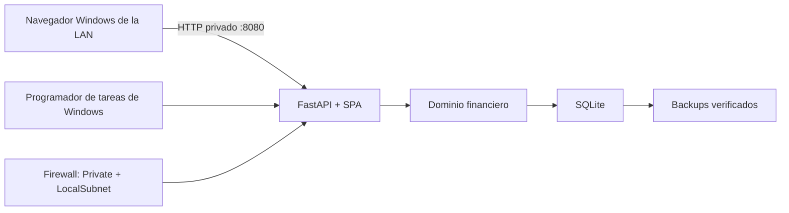

# Arquitectura

## Distribución

Personal Finance es un monolito modular distribuido como un único wheel Python.
FastAPI publica `/api/v1`, `/health/*` y la SPA React/Vite empaquetada en el
mismo origen. Los prefijos reservados y assets ausentes devuelven 404; solo los
deep links de la interfaz reciben `index.html`.

## Límites de módulos

- La interfaz expresa comandos de negocio y nunca crea apuntes arbitrarios.
- El dominio valida invariantes, importes enteros en céntimos y transiciones.
- La capa de aplicación coordina identidad, autorización, idempotencia,
  auditoría y transacciones.
- SQLAlchemy y SQLite implementan persistencia; Alembic gobierna el esquema.
- Backup y restore son comandos locales y no están expuestos por HTTP.

## Despliegue Windows

El instalador usa `%ProgramFiles%\PersonalFinance` para código, Python 3.13 y
el entorno virtual administrados por `uv`. Configuración, base de datos,
backups y logs viven bajo `%ProgramData%\PersonalFinance`. Las ACL conceden el
acceso necesario únicamente a Administradores, SYSTEM y `LOCAL SERVICE`.

`PersonalFinance-App` arranca con el sistema, ejecuta migraciones y el backup
pendiente y sirve Uvicorn en `0.0.0.0:8080`. `PersonalFinance-Backup` se ejecuta
diariamente y recupera ejecuciones perdidas. Ambas tareas se ejecutan como
`LOCAL SERVICE` y tienen reintentos tras fallo.

Windows Firewall permite entrada TCP 8080 solo en el perfil Privado y desde
`LocalSubnet`. La instalación exige confirmar una IPv4 RFC1918 estable; no hay
publicación en Internet.

## Transporte y sesión

El modo operativo comprobado es `http_lan`. Requiere configuración explícita,
un `PF_ALLOWED_ORIGIN` HTTP exacto con IPv4 RFC1918 y una red doméstica de
confianza. La cookie es `pf_session`, `HttpOnly`, `SameSite=Strict` y
`Secure=false`. Origin exacto y CSRF protegen comandos, pero HTTP no aporta
cifrado: credenciales y datos son observables por alguien con capacidad de
interceptar la LAN.

El modo HTTPS permanece como superficie interna de pruebas. Usa
`__Host-pf_session`, `Secure=true`, `HttpOnly`, `SameSite=Strict`, Origin exacto
y CSRF. No se crean ni distribuyen certificados en la operación doméstica.

## Recuperación

SQLite es la única fuente de saldos. La copia diaria utiliza la API de backup de
SQLite, publica atómicamente solo tras `PRAGMA integrity_check = ok` y aplica
retención únicamente a copias catalogadas y verificadas. Restore exige una
copia verificada y un destino nuevo: comprueba integridad, aplica migraciones en
el temporal, vuelve a comprobar y solo entonces publica el archivo aislado.
Nunca sustituye automáticamente la base activa.

## Evidencia

Las pruebas automatizadas cubren dominio, API, persistencia, frontend, HTTPS
interno, ambos modos de sesión y despliegue Windows. El job
`windows-deployment` construye el wheel, analiza PowerShell y levanta el
artefacto por HTTP en un entorno aislado.

La aceptación HITL del 2026-08-10 verificó desde un segundo equipo Windows el
login, los flujos financieros, la denegación sin sesión, el reinicio, la
persistencia, las tareas, el firewall, el backup y una restauración aislada con
`PRAGMA integrity_check = ok`. La evidencia saneada está en
[runbooks/acceptance.md](runbooks/acceptance.md).
